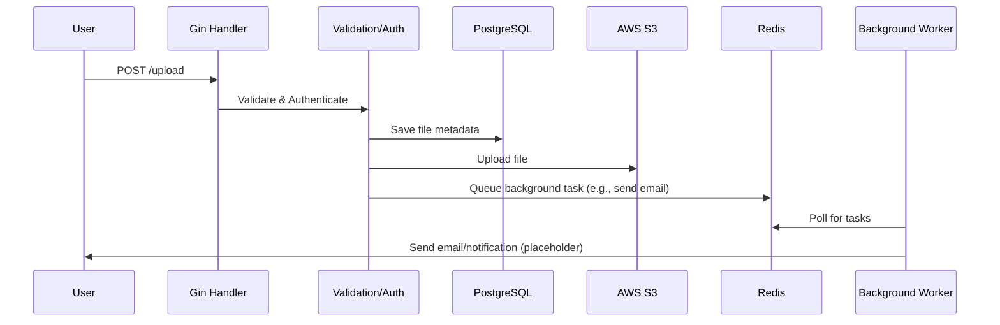

## 📁 Key Subdirectories & Their Roles

| Directory        | Description                                                                 |
|------------------|-----------------------------------------------------------------------------|
| **cmd/**         | Application entry point (`main.go`).                                         |
| **config/**      | Configuration files (e.g., `.env`).                                          |
| **internal/**    | Private app logic, not for external import.                                  |
| **migrations/**  | Database migration scripts.                                                  |
| **models/**      | Go structs mapping to PostgreSQL tables.                                     |
| **services/**    | Core business logic.                                                         |
| **handlers/**    | HTTP route handlers (API endpoints).                                         |
| **middlewares/** | Custom middleware for authentication/validation.                             |
| **redis/**       | Redis queue logic & background workers.                                      |

---

## 🧠 What Is This Project?

A **secure file upload microservice** built with Go (Gin), featuring:

- 📤 Accepts file uploads
- ☁️ Stores files in AWS S3 (or compatible blob storage)
- 🗄️ Tracks metadata in PostgreSQL
- 📨 Uses Redis for background jobs (e.g., email notifications)
- ⏰ Runs cron jobs to clean up old files
- 🐳 Fully dockerized, TDD-ready, and infra-capable

**In short:**  
A backend-only, production-style system for secure file management:

- 🔒 Secure, authenticated uploads
- ⚙️ Background processing
- 🧹 Periodic cleanup
- 🛠️ Infra automation (Docker, cron, graceful shutdown)

---

## ⚙️ High-Level Architecture

| Layer            | Tech Used               | Purpose                                       |
|------------------|------------------------|-----------------------------------------------|
| **API Layer**        | Go + Gin                | Exposes REST routes                           |
| **Auth Layer**       | JWT/Session (TBD)       | Secures file upload                           |
| **DB Layer**         | PostgreSQL + Migrations | Stores metadata (filename, userID, timestamp) |
| **Background Layer** | Redis + Worker          | Email queue, task dispatch                    |
| **Cron Layer**       | Cronjob in Go           | Cleans up old files hourly                    |
| **AWS Layer**        | S3 SDK                  | Uploads files to cloud bucket                 |
| **Docker Layer**     | Docker + Compose        | Full containerization                         |
| **Test Layer**       | Testify, mockgen, SQLC  | Unit, mock, and DB tests                      |
| **DevOps Layer**     | Graceful shutdown       | Clean exit on signal                          |

---

## 🔄 Component Interaction Flow

**Meanwhile:**

- **CronJob (hourly):**
  - Checks DB for expired files
  - Deletes files from S3
  - Removes metadata from DB

---
